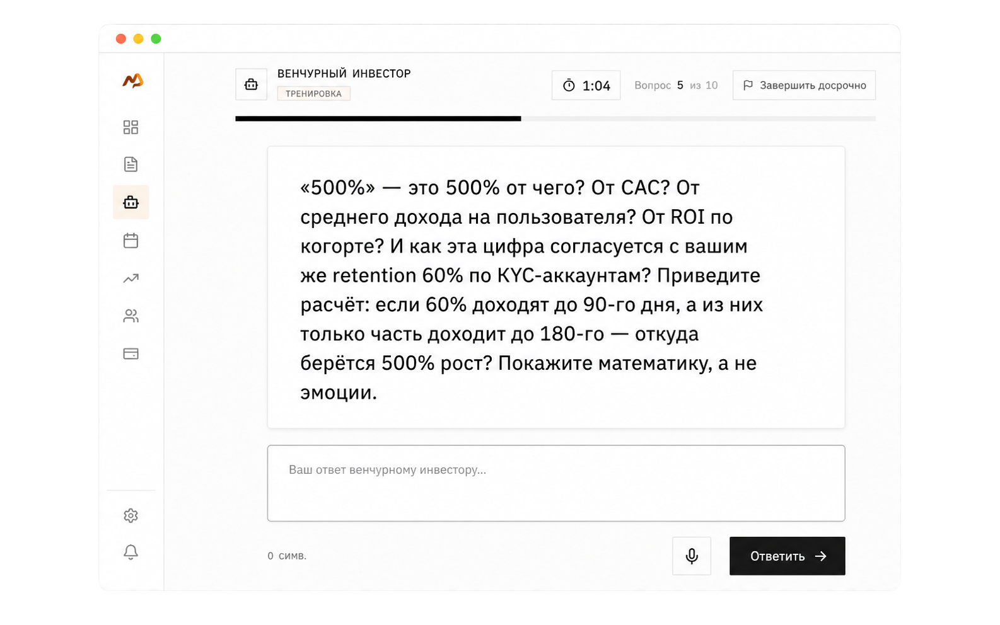
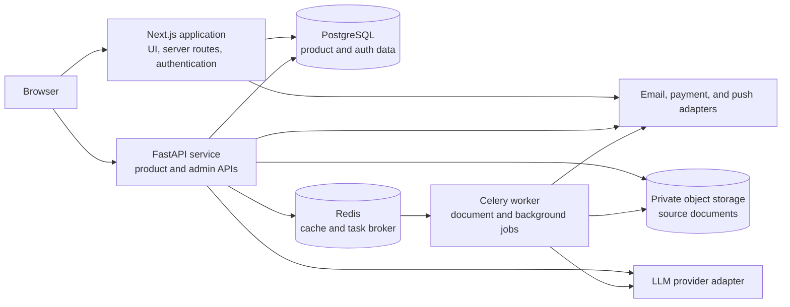

# PeakTalk

[](https://github.com/PeakTalk/peaktalk/actions/workflows/ci.yml)
[](https://github.com/PeakTalk/peaktalk/actions/workflows/codeql.yml)

**AI-assisted stress testing for arguments before difficult work meetings.**<br>
_AI-стресс-тест аргументов перед сложными рабочими встречами._

PeakTalk helps a professional test a concrete position—not generic confidence—
before a roadmap review, budget defense, stakeholder challenge, or similar
high-stakes conversation. A user supplies working material, examines its weak
points, answers adversarial questions in a text-first simulation, and leaves
with a compact Defense Brief.

> **Project status:** test-stage engineering snapshot. This public repository is
> a one-time, sanitized view of the product source and its development history.
> It is suitable for code review and local evaluation, but it is not a public
> production deployment or an operational runbook.



_Adversarial simulation screen with synthetic content. No customer, interview,
or production data is shown._

## What the product does

```text
Working material
      ↓
Weak-point and pressure scan
      ↓
Text-based adversarial simulation
      ↓
Defense Brief: arguments, evidence gaps, risks, and next steps
```

The core contract is deliberately narrow:

- input is a specific initiative, roadmap, budget, memo, or set of arguments;
- observations should be tied to the supplied material or marked as assumptions;
- the simulation tests likely objections instead of scoring charisma or diction;
- typing is always supported; voice input is an optional way to compose text;
- the final artifact is meant to be useful immediately before the real meeting.

See [the core-flow specification](docs/specs/core-flow.md) and
[MVP boundaries](docs/product/mvp-boundaries.md) for the observable product
scope.

## System overview



The diagram describes component responsibilities, not a production network or
deployment topology. The public snapshot intentionally contains no production
access material.

| Area | Technology | Role |
| --- | --- | --- |
| Web | Next.js 16, React 19, TypeScript | Product UI, server-side auth routes, responsive interaction |
| API | FastAPI, Pydantic, SQLAlchemy | Product contracts, authorization, orchestration |
| Persistence | PostgreSQL, Alembic | Auth and product records, schema evolution |
| Background work | Celery, Redis | Parsing, scheduled jobs, cache and task transport |
| Document handling | S3-compatible storage, PDF/DOC/DOCX/TXT/MD parsers | Private source material and text extraction |
| AI integration | OpenAI-compatible provider adapter | Weak-point analysis, adversarial prompts, final brief |
| Quality | Pytest, Node test runner, ESLint, TypeScript, CodeQL | Contract, build, and security checks |

More detail is available in [Architecture](docs/architecture.md).

## Local evaluation

The quickest isolated check does not require external AI, payment, email, or
storage credentials:

```bash
cd backend
python3.12 -m venv .venv
source .venv/bin/activate
python -m pip install -r requirements.lock
pytest

cd ../frontend
npm ci
npm run lint
npm run typecheck
npm test
```

For the local application stack, copy the safe examples and start Compose:

```bash
test -f backend/.env || cp backend/.env.example backend/.env
test -f frontend/.env.local || cp frontend/.env.example frontend/.env.local
docker compose up --build
```

The examples contain localhost values or explicit placeholders only. Do not
replace them with production credentials. Provider-dependent flows remain
unavailable until intentionally configured in a separate local environment.

See [Local development](docs/local-development.md) for ports, migrations,
manual startup, and the full verification commands.

## Repository map

```text
backend/                 FastAPI application, workers, migrations, tests
frontend/                Next.js application and frontend contract tests
docs/
  architecture.md        Components, boundaries, and data flow
  local-development.md   Reproducible local setup and checks
  product/               Product scope and non-goals
  specs/                 Observable behavior
  decisions/             Selected public-safe engineering decisions
  project-history.md     How to inspect the preserved Git history
  research-insights.md   Anonymized, derived discovery insights
.github/                 Review-safe CI, security checks, and governance
THIRD_PARTY_NOTICES.md   Redistributed assets and their upstream licenses
```

## History and provenance

This is not a new repository reconstructed as a single synthetic commit. Its
source history contains **351 rewritten historical commits**, including **18
merge commits**, before the current review-hardening commit. Original author and
committer timestamps, ordered parent relationships, merge topology, commit
subjects, and five selected branch references were preserved. Commit IDs
changed because sensitive content and attribution metadata were filtered;
historical cryptographic signatures therefore cannot be carried over as valid.

Some retained commits are content-empty after excluded material was removed.
They remain in the graph so that the sequence and merge structure are not
silently rewritten into a cleaner-looking story.

Read [Provenance](PROVENANCE.md) for the exact public accounting and
[Project history](docs/project-history.md) for useful Git commands. The private
old-to-new commit map is intentionally not published.

AI coding assistants were used during parts of development and review. They are
tools, not Git authors; human ownership and review responsibility remain with
the project maintainer. This is disclosed in more detail in
[Provenance](PROVENANCE.md).

## Security

- Real secrets are never valid example configuration.
- Production deployment workflows, access instructions, and infrastructure
  topology are outside this repository.
- CI uses least-privilege permissions and does not deploy production systems.
- Please do not publish suspected vulnerabilities, credentials, or user
  material in an Issue or pull request.

Use [Security policy](SECURITY.md) to report a vulnerability privately.

## Known limitations

- The product remains in test stage; this snapshot is not a claim of production
  readiness, availability, or security certification.
- Discovery evidence is a small, non-representative sample. Derived insights are
  hypotheses to validate, not market proof.
- AI output may be incomplete or wrong and must be reviewed against the source
  material before a real decision.
- Full document, email, payment, push, and AI flows require external services;
  local placeholder configuration deliberately does not impersonate them.
- This is a fixed review snapshot and is not continuously synchronized with the
  private production repository.

## Documentation

| Document | Purpose |
| --- | --- |
| [Architecture](docs/architecture.md) | Component responsibilities and trust boundaries |
| [Local development](docs/local-development.md) | Setup, migrations, and checks |
| [Core flow](docs/specs/core-flow.md) | Observable preparation workflow |
| [MVP boundaries](docs/product/mvp-boundaries.md) | In-scope and explicitly excluded outcomes |
| [Project history](docs/project-history.md) | Preserved graph, selected branches, and caveats |
| [Research insights](docs/research-insights.md) | Anonymized functional implications from discovery |
| [Provenance](PROVENANCE.md) | Sanitization and authorship disclosure |
| [Security](SECURITY.md) | Private vulnerability reporting |
| [Contributing](CONTRIBUTING.md) | Review workflow and engineering standards |
| [Third-party notices](THIRD_PARTY_NOTICES.md) | Redistributed assets and upstream license terms |

## Rights

The source is publicly visible for engineering review, but it is **not released
under an open-source license**. See [NOTICE](NOTICE). No additional license is
granted beyond the
[GitHub Terms of Service](https://docs.github.com/en/site-policy/github-terms/github-terms-of-service),
applicable law, or a separate written agreement.
