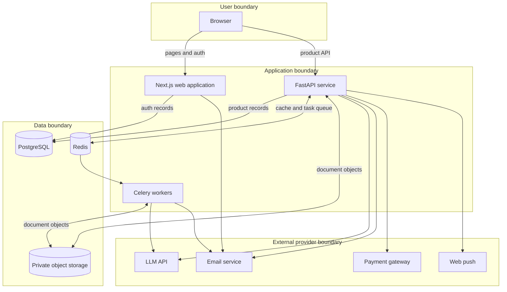

# Architecture

## Purpose and constraints

PeakTalk prepares a user to defend a concrete work position. The system accepts
source material, finds pressure points, runs an adversarial text simulation, and
produces a Defense Brief. The architecture separates interactive requests,
background processing, provider integrations, and durable data so each boundary
can be tested without embedding production configuration in source.

This document describes logical components only. It is not a production network
diagram, capacity plan, or access runbook.

## Components

### Web application

The Next.js application owns presentation, navigation, server-side authentication
routes, and browser-facing session behavior. It calls the product API through a
configured public base URL. Authentication records share the application
database, while the FastAPI layer resolves the authoritative session before
serving protected resources.

### API service

FastAPI exposes product, billing, notification, and administrative contracts.
Pydantic models validate inputs; SQLAlchemy sessions contain database work;
ownership and role checks belong at the request boundary. External AI, storage,
email, payment, and push behavior is reached through service modules rather than
from UI code.

### Worker layer

Celery handles work that should not keep an interactive request open, including
larger document parsing and scheduled lifecycle tasks. Redis provides task
transport and application caching. The API is designed to tolerate cache
failure by falling back to the database; the task broker is still required for
background jobs.

### Data stores

- **PostgreSQL** stores product, user, session, billing, and audit records.
- **Private object storage** holds original uploaded documents; database rows
  reference objects and extracted text.
- **Redis** carries cache entries and queued task state, separated by key
  conventions rather than by a public deployment promise.

Alembic migrations under `backend/alembic/versions/` are the durable schema
history. Migration and application compatibility must be reviewed together.

## Primary data flow

1. The user supplies text or a supported document for a specific meeting.
2. The API validates the request, ownership context, and usage policy.
3. Source material is parsed directly or queued for a worker when appropriate.
4. The AI adapter receives the bounded context needed for analysis and returns
   structured weak points or simulation content.
5. The user answers adversarial questions through the same text contract,
   whether text was typed or composed with optional voice input.
6. The completed session is evaluated and rendered as a Defense Brief that can
   be copied, downloaded, or printed by the frontend.

## Trust boundaries

User material may be confidential even when it contains no credentials. Code
working at a trust boundary should follow these rules:

- authenticate before returning protected product data;
- enforce resource ownership server-side, not through hidden UI controls;
- limit file size and type, sanitize filenames, and parse without shell
  interpolation;
- keep secrets in runtime configuration and never in browser bundles or Git;
- treat model output as untrusted data that requires schema and UI handling;
- avoid logging source text, tokens, email addresses, or stable user identifiers;
- verify payment and webhook authenticity before state changes;
- keep production deployment authority outside the public review repository.

## Failure behavior

The product should make incomplete input, loading, provider failure, and
abandoned sessions explicit. Text input remains available when optional browser
voice input is unsupported or denied. AI output is advisory and should identify
assumptions instead of presenting missing evidence as fact.

## Deployment boundary

The repository includes development containers and review-safe CI. It contains
no production deploy workflow, production environment, server addresses, key
paths, or production secret values. The logical provider adapters above do not
imply that a local checkout can exercise every integration with placeholders.
